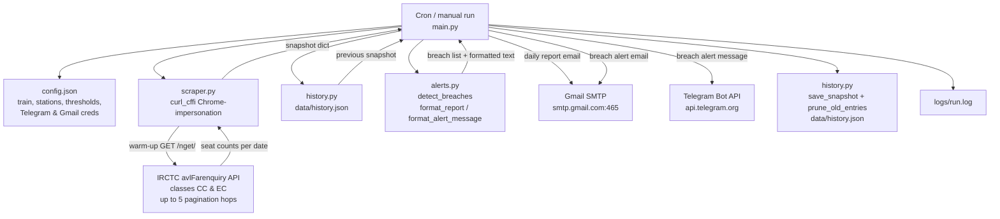

# Architecture

Vande Bharat Monitor is a Python cron job that polls the IRCTC seat-availability API for train 20633 (Calicut → Kottayam), compares the current snapshot against the previous run, and sends a daily report via Gmail plus urgent alerts via Telegram and Gmail whenever seats drop below a threshold or fall sharply.

